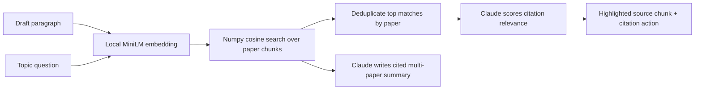

<p align="center">
  
</p>

<h1 align="center">LitBridge</h1>

<p align="center"><em>Your literature library × your paper — AI connects them.</em></p>

<p align="center">
  <a href="https://litbridge.streamlit.app/"><strong>🚀 Live demo</strong></a>
  &nbsp;·&nbsp;
  <a href="assets/LitBridge__AI_Lit_Manager.mp4"><strong>🎥 Intro video</strong></a>
  &nbsp;·&nbsp;
  <a href="assets/LitBridge_Buildathon_Presentation.pdf"><strong>📑 Pitch deck (PDF)</strong></a>
</p>

<p align="center">
  <em>Cold start ~30s if the app is asleep — the bundled 13-paper sample loads automatically.</em>
</p>

<p align="center">
  
</p>

When writing a literature review, the hard part isn't *finding papers once* — it's **remembering which paper in your reading list supports the sentence you're writing right now**. LitBridge turns your personal library into paragraph-level citation suggestions, with the source excerpt highlighted so you can verify before you cite.

Unlike a generic ChatGPT + RAG search box, LitBridge starts from the paragraph you are writing, retrieves candidate evidence from your own library, then shows the exact source chunk beside your draft before you insert a citation.

Built for the **ANU AI Buildathon 2026**.

## 5-minute judge path

Open the [live demo](https://litbridge.streamlit.app/) and:

1. Keep **"Use sample"** selected — a 5-paragraph draft titled *"LLM-based Autonomous Agents: A Survey"* loads automatically, paired with a 13-paper reference library covering exactly the works such a survey would cite (GPT-3, InstructGPT, CoT, ReAct, Generative Agents, Sparks of AGI, …).
2. Click **Analyze sample survey draft** — wait a few seconds for Claude to score paragraphs against the index.
3. Click any paragraph in the draft pane → see the matched paper + a **highlighted source chunk** in the middle pane.
4. Hit **➡️ Insert this citation** to drop an inline citation marker into the draft.
5. Switch to the **Topic Search** tab and try `How does chain-of-thought prompting improve reasoning in LLMs?` to see multi-paper synthesis with `[1][2]` citations.

> If the app is waking from sleep, give it ~30 s. The bundled sample requires no upload.

## Features

- **Smart Cite-Back** — three-pane workspace: a draft editor on the right, a reference reader in the middle, your library on the left. Click a draft paragraph → AI surfaces the best-matching paper, highlights the relevant chunk, and lets you insert an inline citation in one click.
- **Topic Search** — type a research question, get a multi-paper summary with inline `[1][2]` citations and source excerpts.
- **RAG pipeline** — section-aware chunking (drops References/Bibliography), semantic retrieval over locally-cached embeddings, with a keyword fallback if the embedder isn't available offline.

## How it works



## Tech stack

- **UI**: Streamlit (wide layout, custom CSS)
- **PDF / DOCX parsing**: PyMuPDF + python-docx
- **Embeddings**: `sentence-transformers/all-MiniLM-L6-v2` (local, ~80 MB; L2-normalized)
- **Index**: numpy cosine top-k (no vector DB — the corpus is small enough to keep in RAM)
- **LLM**: Claude (`claude-haiku-4-5`) via the official `anthropic` SDK

## Quickstart

```bash
# 1. Clone
git clone https://github.com/xingkongliang/litbridge.git
cd litbridge

# 2. Install dependencies (Python 3.11 recommended — see runtime.txt)
pip install -r requirements.txt
# or with conda: conda env create / conda run -n llm pip install -r requirements.txt

# 3. Set your Anthropic API key
echo "ANTHROPIC_API_KEY=sk-ant-..." > .env

# 4. Run
streamlit run app.py
```

The pre-built index (`data/index/chunks.json` + `embeddings.npy`) is committed to the repo, so the app works out-of-the-box on the bundled sample dataset. No re-embedding required at startup.

## Sample dataset

The repo ships with:

- **Reference library** — 13 foundational LLM-agent papers: GPT-3, InstructGPT, Chain-of-Thought, ReAct, Toolformer, Reflexion, Generative Agents, Voyager, SayCan, Sparks of AGI, etc. (PDFs gitignored; only the index + metadata travel with the repo.)
- **Sample draft** — a 5-paragraph literature review titled *"LLM-based Autonomous Agents: A Survey"* (`data/papers/AI-Agent/user-draft-llm-agents.docx`) covering pretraining, prompting, alignment, embodiment, and multi-agent simulation. Each paragraph is the kind of high-level claim that needs ~1 supporting paper from the library — perfect for showing one-click cite-back end-to-end in a 3-minute demo.

To re-index with your own corpus:

```bash
# Drop PDFs into data/papers/AI-Agent/reference/ then:
LITBRIDGE_ALLOW_MODEL_DOWNLOAD=1 conda run -n llm python scripts/preindex.py
```

## Deploy

The live build runs on Streamlit Community Cloud at <https://litbridge.streamlit.app/>. To deploy your own fork:

1. Push to GitHub
2. https://share.streamlit.io → New app → point at `app.py`
3. Settings → Secrets: paste `ANTHROPIC_API_KEY = "sk-ant-..."`

`runtime.txt` and `st.secrets` integration are already wired up. First-run cold start ≈ 2 minutes (dependencies + embedder model download); after the app is idle it sleeps and takes ~30 s to wake — open the link a few minutes before any demo.

## Team

Built with ❤️ for ANU AIMSOC & ANUEC AI Buildathon.
